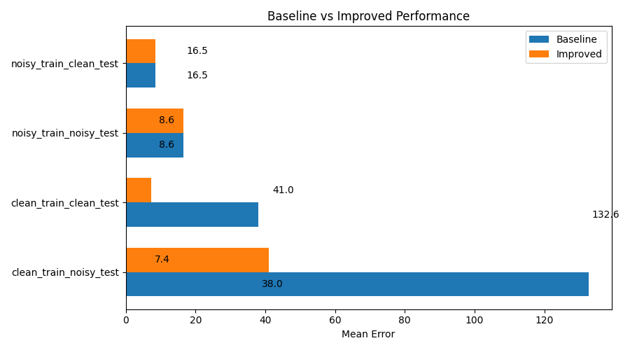

# Robust Trajectory Prediction under Noisy Perception

## Overview

Trajectory prediction models are typically trained and evaluated under clean input conditions.
However, real-world perception systems introduce noise in the form of missing detections, jitter, and imperfect tracking.

This project studies the impact of such noise and investigates **training strategies to improve robustness without modifying model architecture**.

---

## Problem

A model trained on clean trajectories suffers severe performance degradation when evaluated under noisy inputs.

| Setting                  | Mean Error |
| ------------------------ | ---------- |
| Clean Train → Clean Test | ~7.3       |
| Clean Train → Noisy Test | ~132       |

This highlights a significant **generalization gap** caused by distribution shift between training and deployment.

---

## Approach

We address this issue through **noise-aware training**.

### Noise Modeling

We simulate realistic perception noise:

* Random trajectory dropout
* Gaussian perturbations

### Training Strategy

Models are trained under controlled configurations:

* Clean → Clean
* Clean → Noisy
* Noisy → Clean
* Noisy → Noisy

The focus is on enabling the model to learn **invariance to input corruption**.

---

## Results

The proposed approach significantly improves robustness:

* Baseline (Clean → Noisy): **132**
* Improved: **41**

This corresponds to an approximate **70% reduction in error**, while maintaining strong clean performance.



---

## Analysis

* Noise-aware training improves generalization under distribution shift
* Clean performance remains stable (~7–8 range)
* The model learns to ignore small perturbations instead of overfitting to clean signals

---

## Ablation Insights

Several architectural modifications were explored:

* Attention mechanisms
* Input denoising modules
* Latent consistency constraints

These approaches introduced instability and did not yield consistent improvements.

This suggests that **robustness is primarily governed by data and training strategy rather than architectural complexity** in this setting.

---

## Key Takeaways

* Distribution shift is a critical failure mode in trajectory prediction
* Robustness can be significantly improved without changing model architecture
* Controlled noise injection is an effective and simple solution
* Incremental experimentation is essential for stability

---

## Reproducibility

Run training with:

```bash
python train.py --conf ../config/config.json --device cpu --eval_device cpu
```

---

## Project Structure

```
config/         configuration files  
trajectron/     model implementation  
results/        experiment outputs and plots  
scripts/        visualization utilities  
```

---

## Future Work

* Learnable noise models
* Robust latent representations
* Domain randomization across diverse noise types
* Integration with perception pipelines

---

## Conclusion

This work demonstrates that robustness in trajectory prediction is largely a function of **training methodology** rather than model complexity.

Carefully designed noise-aware training can bridge the gap between clean benchmarks and real-world deployment.
