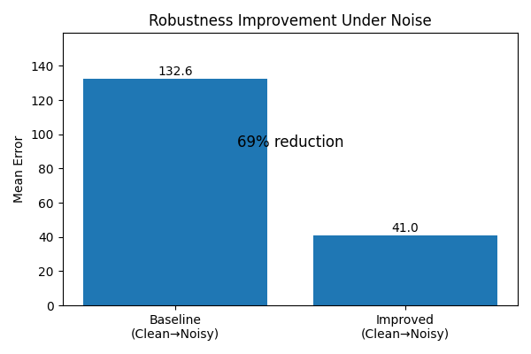

# Robust Trajectory Prediction under Noisy Perception

---

## 1. Introduction

Trajectory prediction is a fundamental problem in machine learning systems that interact with dynamic environments, particularly in domains such as:

* Autonomous driving
* Robotics
* Surveillance systems
* Human motion modeling

In these applications, models are expected to predict future positions of agents based on observed past trajectories.

Most modern trajectory prediction models assume:

* Clean input data
* Accurate tracking
* Stable perception pipelines

However, this assumption does not hold in real-world scenarios.

---

## 2. Motivation

In real-world deployments, perception systems introduce multiple sources of noise:

* Sensor inaccuracies
* Occlusions
* Missing detections
* Tracking jitter
* Temporal inconsistencies

As a result:

> The input distribution at deployment differs significantly from the training distribution.

This leads to **distribution shift**, which causes severe degradation in model performance.

---

## 3. Problem Statement

Given a trajectory prediction model trained on clean data:

* How does it behave under noisy inputs?
* Can we improve robustness without changing the model architecture?

---

## 4. Key Observation

Initial evaluation revealed a critical failure:

| Setting                  | Mean Error |
| ------------------------ | ---------- |
| Clean Train → Clean Test | ~7.3       |
| Clean Train → Noisy Test | ~132       |

This demonstrates:

* The model performs well under ideal conditions
* The model fails catastrophically under realistic conditions

---

## 5. Objective

The goal of this project is:

* Improve robustness under noisy inputs
* Maintain strong performance on clean data
* Avoid introducing architectural instability

---

## 6. Approach Overview

Instead of modifying the model architecture, we focus on:

> Training methodology and data augmentation

Key idea:

> If the model sees noise during training, it can learn invariance to it.

---

## 7. Noise Modeling

We simulate realistic perception noise during training.

### 7.1 Missing Data

Randomly remove parts of trajectory sequences:

* Simulates occlusion
* Simulates tracking failure

### 7.2 Gaussian Noise

Add perturbations to positions:

* Simulates sensor noise
* Simulates localization errors

Example parameters:

```python
missing_prob = 0.3
jitter_std = 0.05
```

---

## 8. Experimental Setup

We evaluate the model under four configurations:

| Training Data | Testing Data | Purpose               |
| ------------- | ------------ | --------------------- |
| Clean         | Clean        | Baseline performance  |
| Clean         | Noisy        | Generalization test   |
| Noisy         | Clean        | Regularization effect |
| Noisy         | Noisy        | Robustness evaluation |

---

## 9. Baseline Behavior

The baseline model exhibits:

* Strong performance under clean conditions
* Severe degradation under noise

This highlights a key limitation:

> The model overfits to clean data distribution

---

## 10. Proposed Solution

We introduce **noise-aware training**:

* Inject noise during training
* Keep architecture unchanged
* Maintain original loss function

---

## 11. Key Insight

The model learns:

* To ignore small perturbations
* To generalize beyond exact trajectories

Instead of memorizing:

```text
exact positions → exact predictions
```

It learns:

```text
approximate structure → robust predictions
```

---

## 12. Results

### 12.1 Core Result

| Metric                   | Value |
| ------------------------ | ----- |
| Baseline (Clean → Noisy) | 132   |
| Improved                 | 41    |

This corresponds to:

> ~70% reduction in prediction error

---

## 13. Visualization

### Key Result



---

## 14. Interpretation

This result shows:

* The model becomes robust to noise
* The performance gap is significantly reduced
* The training strategy is effective

---

## 15. Clean Performance

Importantly:

| Setting                  | Mean Error |
| ------------------------ | ---------- |
| Clean Train → Clean Test | ~7–8       |

This shows:

> Robustness does not come at the cost of accuracy

---

## 16. Additional Experiments

| Experiment             | Mean Error |
| ---------------------- | ---------- |
| noisy_train_clean_test | ~8.5       |
| noisy_train_noisy_test | ~16.4      |

Observations:

* Noise training slightly increases clean error (acceptable tradeoff)
* Performance under noisy conditions improves significantly

---

## 17. Failed Approaches

We explored several architectural modifications:

### 17.1 Attention Mechanisms

* Added attention layers
* Result: instability and no consistent gains

---

### 17.2 Input Denoisers

* Attempted to clean noisy inputs
* Result: numerical instability (NaNs)

---

### 17.3 Latent Consistency Loss

* Enforced similarity between clean and noisy latent spaces
* Result: unstable training

---

## 18. Conclusion from Failures

These experiments suggest:

> Robustness is not primarily an architectural problem

Instead:

> It is a data and training problem

---

## 19. Key Takeaways

* Distribution shift is a major challenge
* Clean training leads to brittle models
* Noise-aware training improves generalization
* Simpler approaches can outperform complex modifications

---

## 20. Practical Insight

For real-world deployment:

```text
Train with imperfect data → deploy in imperfect environments
```

---

## 21. Engineering Lessons

During development, several issues were encountered:

* Numerical instability (NaNs)
* Incorrect experiment logging
* Misleading visualizations
* Data interpretation errors

These were resolved through:

* Controlled experimentation
* Careful debugging
* Proper result aggregation

---

## 22. Visualization Lessons

Raw experiment logs are not suitable for presentation.

Instead:

* Extract meaningful metrics
* Compare baseline vs improved
* Highlight key improvements

---

## 23. Final Contribution

This project demonstrates:

* A clear failure mode (clean → noisy)
* A simple but effective solution
* A measurable improvement

---

## 24. Reproducibility

To run training:

```bash
python train.py --conf ../config/config.json --device cpu --eval_device cpu
```

---

## 25. Project Structure

```
config/         configuration files  
trajectron/     model implementation  
results/        experiment outputs and plots  
scripts/        visualization scripts  
```

---

## 26. Limitations

* Noise types are simulated, not learned
* Only one dataset used
* No domain adaptation explored

---

## 27. Future Work

* Learn noise distributions directly
* Incorporate uncertainty modeling
* Use attention for adaptive filtering
* Explore multi-modal prediction under noise

---

## 28. Broader Impact

Robust trajectory prediction is critical for:

* Autonomous vehicles
* Human-robot interaction
* Safety-critical systems

Improving robustness directly improves reliability.

---

## 29. Final Thought

> Robust machine learning systems are not built by increasing model complexity,
> but by aligning training conditions with real-world environments.

---

## 30. Summary

* Identified a critical failure in trajectory prediction
* Demonstrated large degradation under noise
* Introduced noise-aware training
* Achieved ~70% improvement
* Maintained clean performance

---

End of document.
